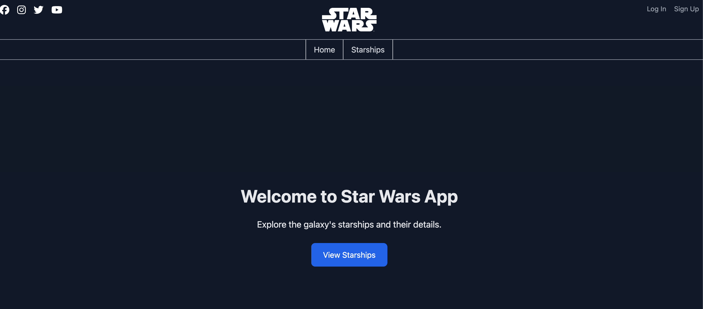
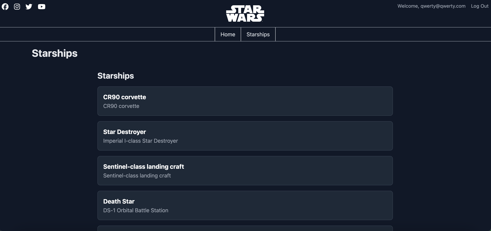
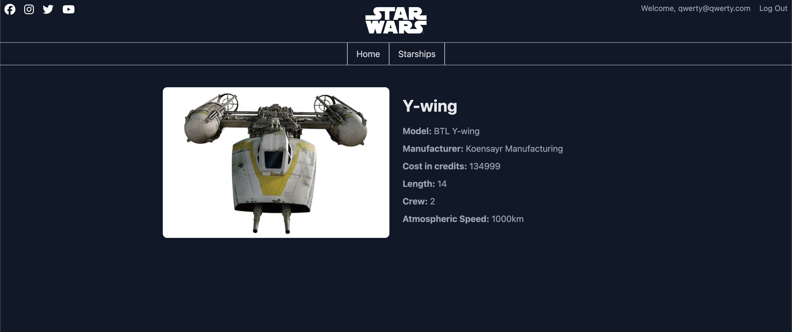

# Star Wars Project

This project is an interactive web application that allows users to explore the Star Wars universe. It includes features like navigation through starships, user authentication, and responsive design for different screen sizes. The app is built using modern web development technologies and connected to Firebase for authentication and data handling.


# Image Carousel Example

<div style="display: flex; overflow-x: auto; gap: 16px; padding: 16px; border: 1px solid #ddd; border-radius: 8px;">

  
  
  
  
</div>

---

## Technologies Used

- **TypeScript**
- **React** (with functional components)
- **Redux Toolkit** (for state management)
- **React Router DOM** (for navigation)
- **Tailwind CSS** (for styling)
- **FontAwesome** (for icons)
- **Firebase** (for user authentication)
- **Vite** (for development and build)
- **Storybook** (for UI component testing)

---

## Installation

Follow these steps to set up and run the project locally:

1. Clone this repository:
   ```bash
   git clone https://github.com/Aleksei-Che/s7v2.git

2. Navigate to the project directory:
```bash
cd s7v2/S7-star-wars
```
3. Install the dependencies:
```bash
npm install
```

4. Create a .env file in the root directory and add your Firebase configuration:
```.env
VITE_FIREBASE_API_KEY=your-api-key
VITE_FIREBASE_AUTH_DOMAIN=your-auth-domain
VITE_FIREBASE_PROJECT_ID=your-project-id
VITE_FIREBASE_STORAGE_BUCKET=your-storage-bucket
VITE_FIREBASE_MESSAGING_SENDER_ID=your-messaging-sender-id
VITE_FIREBASE_APP_ID=your-app-id
```
---
## Execution

1. Run the development server:
```bash
npm run dev
```
2. Open your browser and navigate to:
```arduino
http://localhost:5173
```
---
## Contribution
We welcome contributions! Follow these steps to contribute to the project:

1. Fork the repository.
2. Create a new branch:
```bash
git checkout -b feature-branch
```
3. Make your changes and commit them:
```bash
git commit -m 'Add new feature'
```
4. Push to the branch:
```bash
git push origin feature-branch
```
5. Open a Pull Request.
---
## License
This project is licensed under the MIT License.


